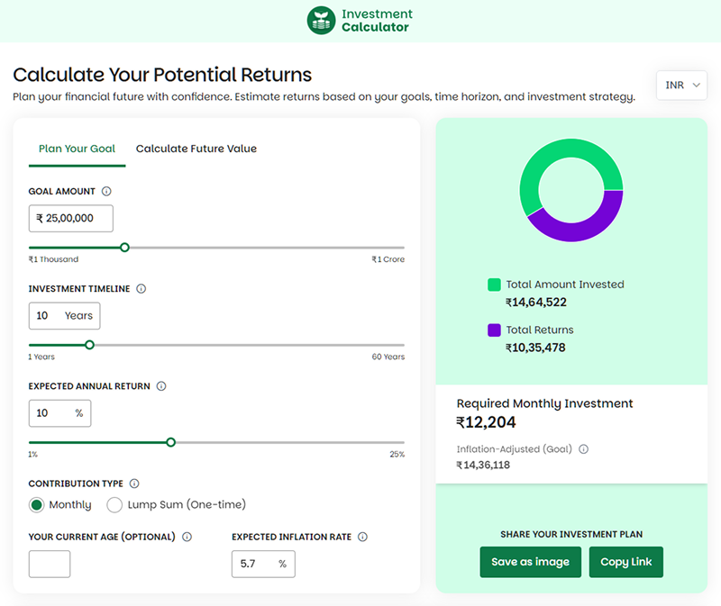

# Investment Calculator

Simple investment calculator that helps you figure out your financial goals. Share your calculations with others or just use it to plan ahead.



## What it does

- **Two calculation modes**: Figure out how much to invest monthly to hit a target, or see what your current plan might get you
- **Inflation adjustment**: Shows real purchasing power of your returns
- **Currency support**: Switch between INR and USD
- **Progress tracking**: See how your investment grows over time with charts
- **Easy sharing**: Send your calculations via URL or download results as images
- **Clean interface**: Works on desktop and mobile

Built with React, Tailwind CSS, and Recharts for the graphs.

## Setup

```bash
git clone https://github.com/thegreatcodebender/investment-calculator.git
cd investment-calculator
npm install
npm run dev
```

That's it. Pick your numbers, see the results, share if you want.
